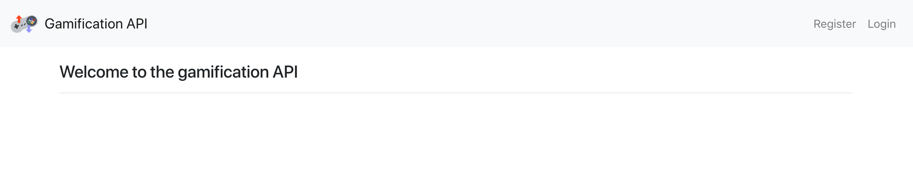
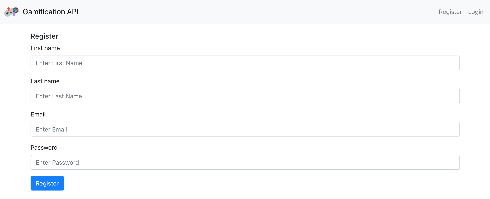
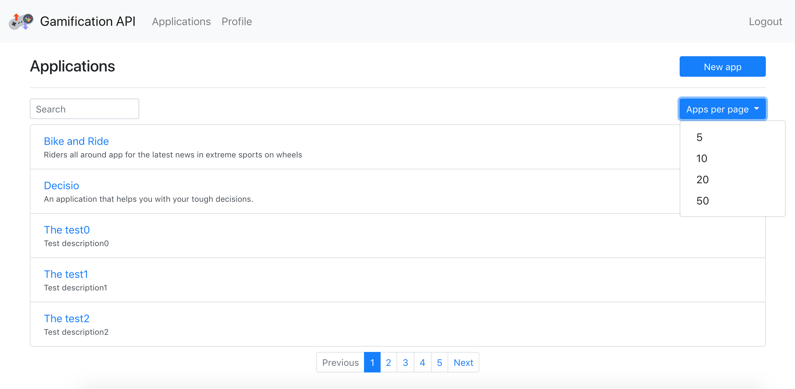
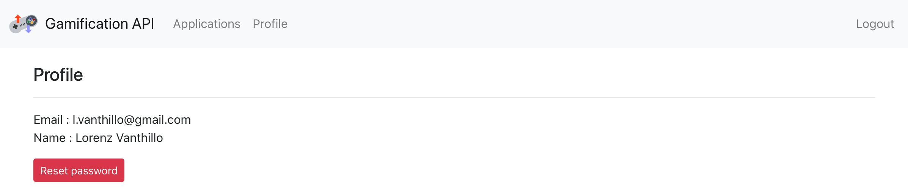
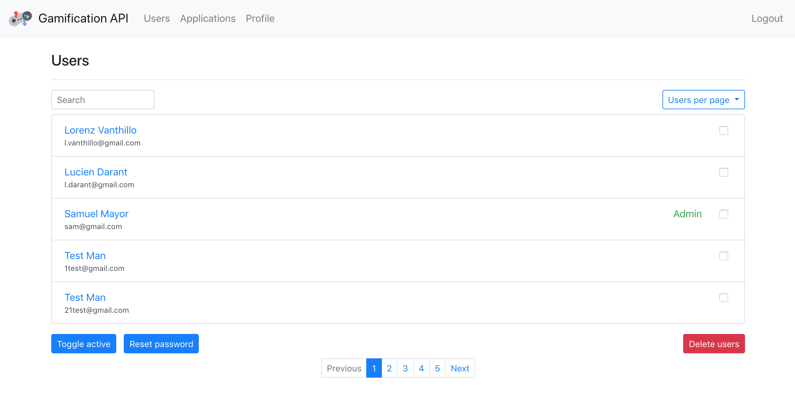

## Gamification - WP 1

### Launching  
To launch the application, the `docker-compose up --build` command has to be executed from the topology-project directory. The application will be run at `localhost:8080/gamification`. The database can be found at `localhost:8888` (_username:_ root, _password:_ root) in the phpMyAdmin interface. Payara server administration console can be found at `localhost:4848` (_username:_ admin, _password:_ admin).

### Overview  
Once connected, the user will be redirected to the gamification home page. He/she then can register or login to his/her account.  

  

* __Registration__  
To create a new account, the user has to enter his/her first and last names, the email address and the password. Once the `Register` button clicked and the fields verifications performed, an account activation email is sent to the user. The user can activate the account by clicking the link received in the email.
  

* __UI__  
Once logged in, the user can view his/her applications and the profile.  

 User's applications page:
   
 Five, ten, twenty or fifty applications can be displayed per page. If the user desires to add a new application, he/she must click the `New app` button and provide the name and the description of the new application.  

 New application page:  
 

 User's profile page:   
   
 The user can reset his/her password by clicking the `Reset password` button. In this case, the user is redirected to the Reset Password where he is asked to enter the new password.
* __Administration console__   
Besides the profile and application pages, the administrator is able to view the list of registered users and all of their applications.  
  
The administrator can also bring a user (or multiple users, by activating the ckeckboxes) active, reset the user's password and delete a user.

### Implementation  
The project contains several packages:   
* __business__ package represents the Business Tier  and is responsible of the business logic of the application. Typically, classes of this package verify the data entered by the user and send emails.  
* __dao__ package contain Data Access classes which are responsible of retrieving data from the database. All the classes of this package extend the _GenericDAO_ class that implement the basic CRUD functionalities.  
* __model__ package contain the Model entities of the application, such as _Application_, _User_ and _UserToken_.
* __presentation__ package represents the Presentation Tier and contains the servlets which manage the http requests and forward the results to the .jsp pages.  

__Notes:__  
* The .jsp files generating the web pages can be found in the `webapp/WEB-INF/pages` directory.  
* We used the SQL database to store the data and JDBC API to access it.

### Tests     
Functional tests, as long as non functional pagination transactions tests have been performed on our project. The test reports can be found in [TESTING_NON_FUNCTIONAL_TRANSACTION](https://github.com/YOLOctopus/Teaching-HEIGVD-AMT-2018-Project/tree/master/TESTING_NON_FUNCTIONAL_TRANSACTIONS), [TESTING_NON_FUNCTIONAL_PAGINATION](https://github.com/YOLOctopus/Teaching-HEIGVD-AMT-2018-Project/tree/master/TESTING_NON_FUNCTIONAL_PAGINATION) and [TESTING_FUNCTIONAL.md](https://github.com/YOLOctopus/Teaching-HEIGVD-AMT-2018-Project/blob/master/TESTING_FUNCTIONAL.md). The tests implementation can be found in the `gamification-test-transaction`, `testing-non-functional-pagination` and `gamification-test-functional` branches of the project.
