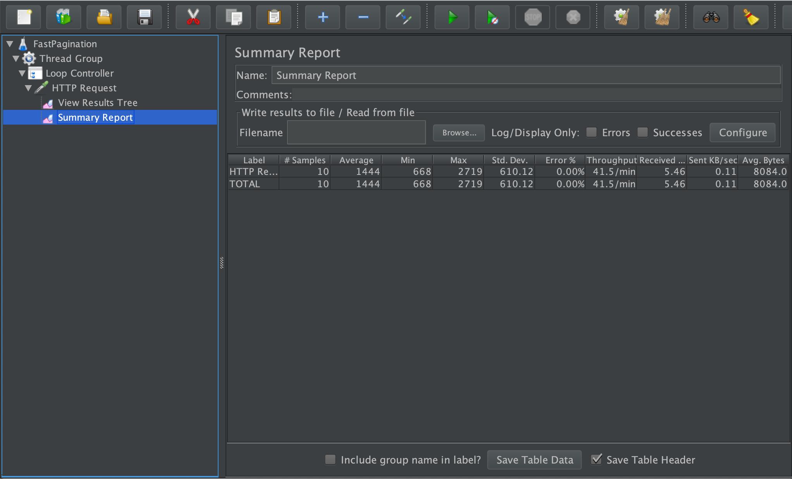

#### Non Functional Pagination Test    
One of the approaches for the displaying of the fixed number (N) of the user's applications would be to retrieve all of the user's applications first, and then display only N of them. This solution would obviously be suboptimal.  
Another approach would be to take an advantage of using the SQL functionalities and only retrieve N applications from the database in this case.   
To point out the difference between these two solutions in terms of the performance, we have set up a JMeter test. The test plan contains a Loop Controller, which sends 10 GET requests to the applications page, and a Summary Report that displays the minimum, maximum and the average times needed to execute the operations of the Loop Controller. The test was performed on a sample database in which 100000 applications are attributed to a certain user. The default number of pages displayed by our application is equal to 5. Therefore, the Summary Report results displayed below are showing the time needed to display 5 applications out of 10000 10 times.

Summary Report results for the slow pagination

Summary Report results for the fast pagination (using SQL functionalities)
   

As we can see, the difference in times needed to execute the tests is remarkable. It takes approximately 10 times more time to display the results by retrieving all of the user's applications.  

__Note:__ the "slow" pagination, used for the test, as long as the JMeter test plan, can be found in _using-non-functional-pagination_ branch of our project.
