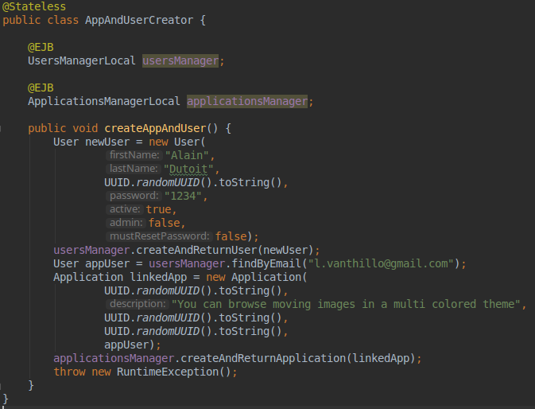
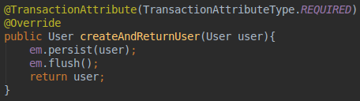
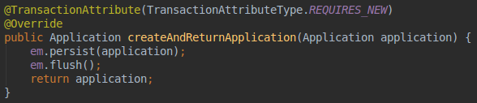

# Non-functional testing - Transactions
In this report, we are going to take a look at Java EE transactions. It is possible to apply a transaction attribute at the class-level to specify its default transaction attibute or at method-level for a more precise setting. Six different attributes are available and are described as follow.

### NOT_SUPPORTED
A NOTSUPPORTED_ method is guaranteed to never be executed in a transaction. If the caller attempts to invoke the method inside of a transaction, the container will suspend the caller's transaction, execute the method, then resume the caller's transaction.

### SUPPORTS
A SUPPORTS method is guaranteed to adopt the exact transactional state of the caller. These methods can be invoked by caller's inside or outside of a transaction. The container will do nothing to change that state.

### REQUIRED
It is the default attribute. A REQUIRED method is guaranteed to always be executed in a transaction. If the caller attempts to invoke the method outside of a transaction, the container will start a transaction, execute the method, then commit the transaction.

### REQUIRES_NEW
A REQUIRESNEW_ method is guaranteed to always be executed in a transaction. If the caller attempts to invoke the method inside or outside of a transaction, the container will still start a transaction, execute the method, then commit the transaction. Any transaction the caller may have in progress will be suspended before the method execution then resumed afterward.

### MANDATORY
A MANDATORY method is guaranteed to always be executed in a transaction. However, it's the caller's job to take care of suppling the transaction. If the caller attempts to invoke the method outside of a transaction, then the container will block the call and throw them an exception.

### NEVER
A NEVER method is guaranteed to never be executed in a transaction. However, it's the caller's job to ensure there is no transaction. If the caller attempts to invoke the method inside of a transaction, then the container will block the call and throw them an exception.

## Experimentation with a test application
To test this feature, we set up a test application from the Gamification project sources. It contains a new EJB named "AppAndUserCreator" that create a new user with UserManager EJB and create a new application with ApplicationManager EJB. The goal of this experiment is to show that it is possible with transaction attributes to define which data should be rolled back in case of a problem and which data should not.  



The AppAndUserCreator EJB has a createAppAndUser() method that first creates a user then creates an application.  
The UserManager method used to create a new user has the attribute REQUIRED and the ApplicationManager method used to create an application has the attribute REQUIRES_NEW. It means that when creating a new application with this method, a new transaction will be started to execute the method.  





As we can see in the createAppAndUser() method, it throws an exception after inserting a user and an application. Now four outcomes are possible : 
1. Both the user and the application are rolled back. The database stays in its original state.
2. The user is rolled back but not the application.
3. The application is rolled back but not the application.
4. Neither are rolled back.  

In our case only the user is rolled back. That's because we set the transaction attribute of the create method of the application manager class to REQUIRE_NEW. A new transaction is created for this method only and when finished, commits the data. The first transaction then continues and a runtime error is thrown, rollbacking the user creation.  

Bellow are the result of our experiment. We can see that the user count does not increment but the application count does.

```
User count before : 30
Application count before : 170925
Error during app and user creation
User count after : 30
Application count after : 170926
```
Repository of test application : https://github.com/Etnarion/Teaching-HEIGVD-AMT-2018-TransactionTests
